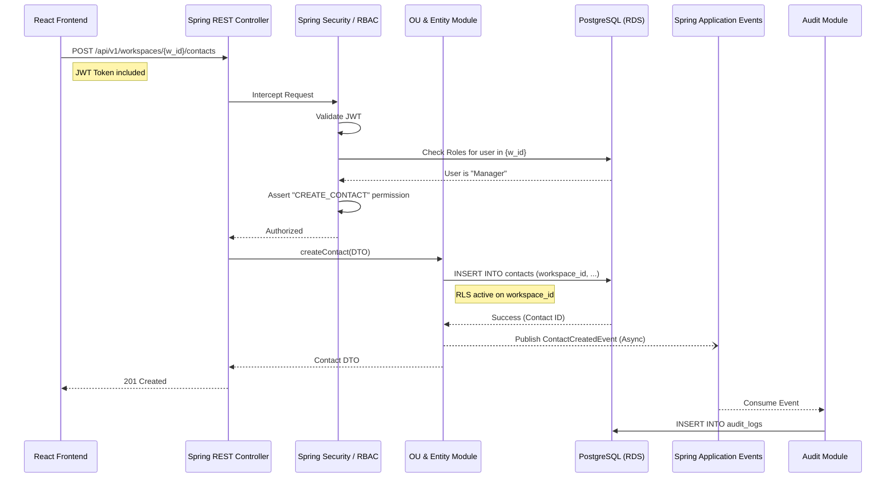

# Data Flow: Création d'une Entité (Contact) & Audit Asynchrone

Ce diagramme de séquence montre l'application de la sécurité RLS et l'utilisation du bus d'événements pour l'audit sans bloquer l'utilisateur.

