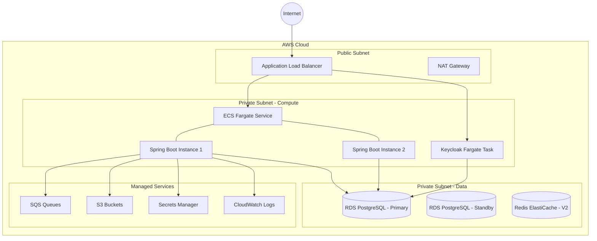

# Deployment Architecture (AWS)

Ce diagramme montre l'isolation réseau VPC et la répartition des services gérés par AWS.

```mermaid
graph TB
    subgraph AWS Cloud
        subgraph Public Subnet
            ALB[Application Load Balancer]
            NAT[NAT Gateway]
        end

        subgraph Private Subnet - Compute
            ECS_Service[ECS Fargate Service]
            Container1[Spring Boot Instance 1]
            Container2[Spring Boot Instance 2]
            ECS_Service --- Container1
            ECS_Service --- Container2
            Keycloak_Task[Keycloak Fargate Task]
        end

        subgraph Private Subnet - Data
            RDS_Primary[(RDS PostgreSQL - Primary)]
            RDS_Replica[(RDS PostgreSQL - Standby)]
            ElastiCache[(Redis ElastiCache - V2)]
        end

        subgraph Managed Services
            SQS[SQS Queues]
            S3[S3 Buckets]
            Secrets[Secrets Manager]
            CloudWatch[CloudWatch Logs]
        end
    end

    Internet((Internet)) --> ALB
    ALB --> ECS_Service
    ALB --> Keycloak_Task
    
    Container1 --> RDS_Primary
    Container2 --> RDS_Primary
    Keycloak_Task --> RDS_Primary
    
    Container1 --> SQS
    Container1 --> S3
    Container1 --> Secrets
    Container1 --> CloudWatch
```
