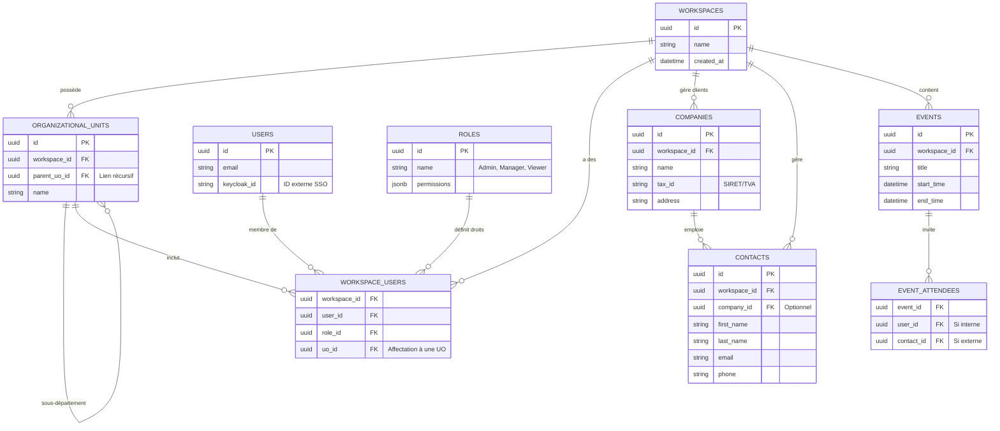

# 05 - Database Schema (Modèle de Données)

## Vue d'ensemble
Ce document décrit le schéma relationnel initial de l'application. La sécurité multi-tenant est la clé de voûte de ce modèle, reposant sur le principe de Row Level Security (RLS) garanti par PostgreSQL.

## Détails et Conventions

### 1. Row Level Security (RLS)
- **Convention** : TOUTES les tables métier (sans exception) possèderont une colonne `workspace_id`.
- **Pourquoi ?** : Le RLS de PostgreSQL utilisera cet identifiant plat pour bloquer silencieusement toute lecture/écriture d'un locataire sur les données d'un autre. Si un développeur oublie une clause `WHERE workspace_id = ?`, la base de données interceptera l'erreur, garantissant zéro fuite de données.

### 2. Typage des Clés Primaires
- Utilisation systématique de `UUID` (générés côté application ou via `gen_random_uuid()` en BD) pour rendre les ressources non prédictibles (meilleure sécurité que les entiers auto-incrémentés).

## Schéma ERD (Mermaid)

## Décision finale
L'intégration de la colonne `workspace_id` partout permet une scalabilité immense et une sécurité infranchissable. La modélisation de l'arbre `ORGANIZATIONAL_UNITS` par auto-jointure (`parent_uo_id`) est standardisée.

## Prochaines étapes
- [ ] Préparer les scripts Flyway pour ce schéma.
